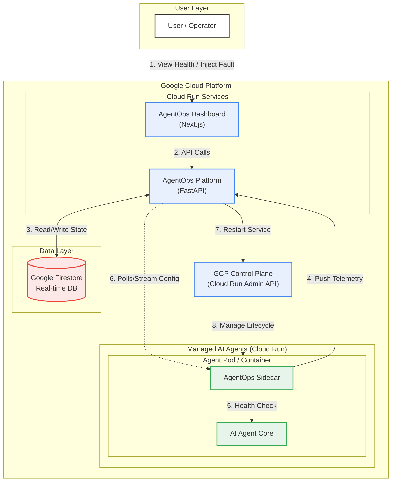
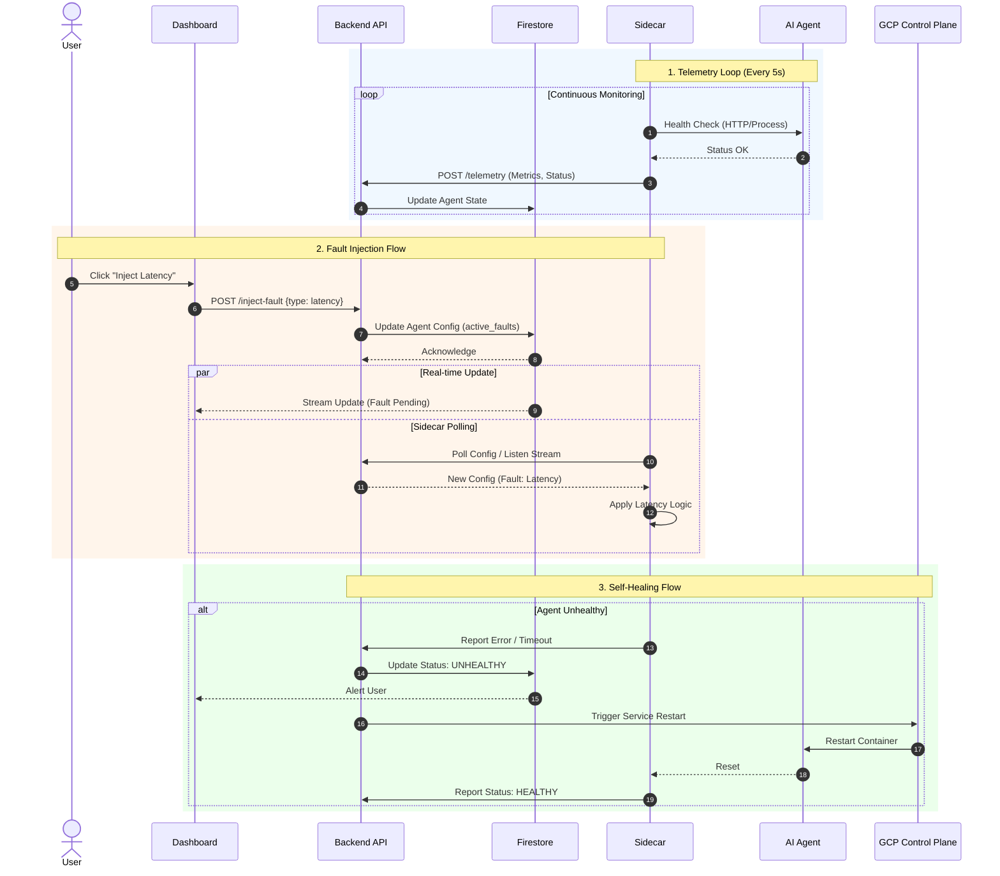

# AgentOps: AI Agent Observability & Self-Healing

**AgentOps** is an operation dashboard designed to monitor the health of AI agents running on Google Cloud Infrastructure. It provides real-time observability, vulnerability reporting, fault injection testing, and automated self-healing capabilities.


## 🚀 Features

*   **Real-time Monitoring**: Track agent health, latency, and error rates via a centralized dashboard.
*   **Sidecar Pattern**: Lightweight sidecar process runs alongside agents to push telemetry without modifying agent core logic.
*   **Fault Injection**: Simulate production issues (High Latency, Crashes) directly from the UI to test resilience.
*   **Self-Healing**: Automated recovery mechanisms to restart unhealthy agents.
*   **Cloud Native**: Built for Google Cloud Run with Firestore for real-time state management.

## 🏗️ Architecture

The system consists of three main components:
1.  **Dashboard (Frontend)**: Next.js application for visualization and control.
2.  **Platform (Backend)**: FastAPI service handling telemetry and GCP control plane interactions.
3.  **Agents & Sidecars**: AI Agents (e.g., Gemini-powered Chat/Summary bots) paired with a telemetry sidecar.

See [Architecture Design](architecture_design.md) for details.

## 🛠️ Getting Started (Local)

Run the entire stack locally using Docker Compose.

### Prerequisites
*   Docker & Docker Compose
*   Google Cloud Credentials (optional for local mock)

### Quick Start
```bash
# Clone the repository
git clone <your-repo-url>
cd agentops

# Start services
docker-compose up --build
```

Access the services:
*   **Dashboard**: [http://localhost:3000](http://localhost:3000)
*   **Backend API**: [http://localhost:8000](http://localhost:8000)

## ☁️ Cloud Deployment (Google Cloud Run)

We provide detailed guides to deploy AgentOps to Google Cloud Platform.

1.  **[GCP Setup Guide](gcp_setup.md)**: Configure your project, enable APIs, and setup your environment.
2.  **[Manual Deployment Guide](manual_deploy_guide.md)**: Step-by-step commands to build and deploy Backend, Frontend, and Agents.

## 🧪 Verification & Usage

### 1. Check Agent Health
Open the Dashboard. You should see cards for `chat-service` and `summary-service` (or `demo-service` locally) with **HEALTHY** status.

### 2. Inject Faults
1.  Click **Inject Latency** on an agent card.
2.  Observe the **Latency** metric spike (>2000ms) after a few seconds.
3.  Click **Inject Error** to simulate a crash. Status will turn **UNHEALTHY**.

### 3. Test Self-Healing
1.  When an agent is **UNHEALTHY**, click **Recover**.
2.  The system will clear the fault state and (in a real cloud env) trigger a service restart.
3.  Status should return to **HEALTHY**.

## 📂 Project Structure

```
├── agents/             # Sample AI Agents (Chat, Summary)
├── backend/            # FastAPI Platform Backend
├── frontend/           # Next.js Dashboard
├── sidecar/            # Telemetry Sidecar Script
├── architecture_design.md
├── gcp_setup.md
├── manual_deploy_guide.md
├── docker-compose.yml
└── diagrams/           # Mermaid.js Diagram Scripts
```

## 📊 Diagrams

### System Architecture
[Source Script](diagrams/architecture.mmd)



### Sequence Diagram (Workflows)
[Source Script](diagrams/sequence.mmd)


