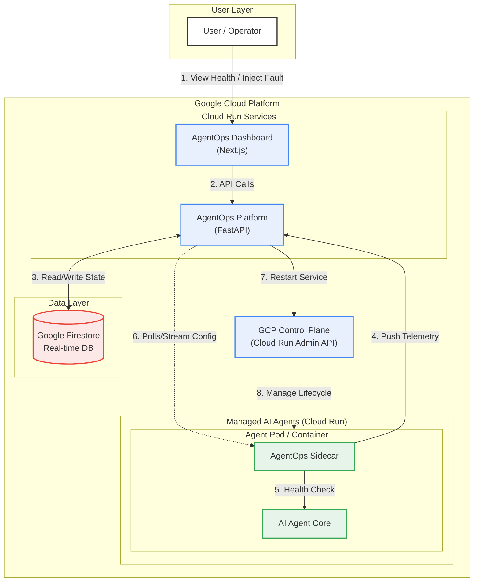
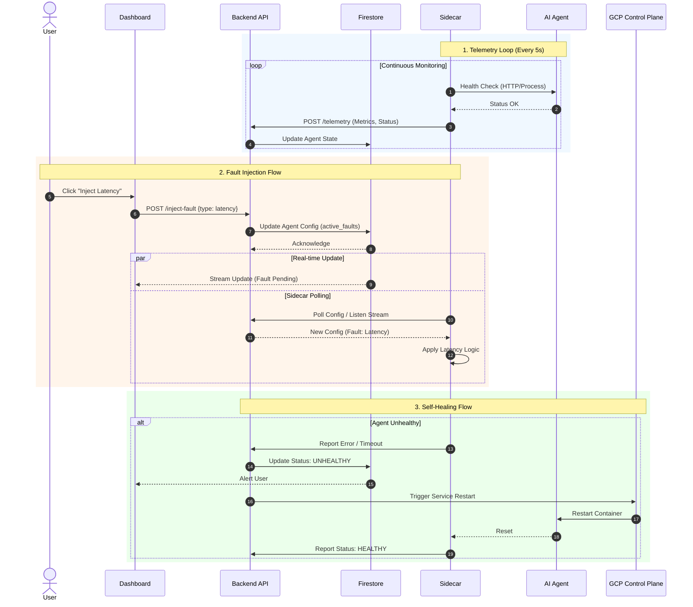

# AgentOps System Architecture & Design (MVP)

## 1. System Overview
AgentOps is an observability and operations dashboard designed to monitor, manage, and self-heal AI Agents running on Google Cloud Platform (GCP). It uses a **Sidecar Pattern** to collect telemetry from agents and provides a centralized dashboard for visualization, fault injection, and automated recovery.

## 2. High-Level Architecture

The system consists of three main components:
1.  **AgentOps Dashboard (Frontend)**: A Next.js web application for users to view health, inject faults, and trigger recovery.
2.  **AgentOps Platform (Backend)**: A Python FastAPI service that aggregates telemetry, manages state in Firestore, and interacts with the GCP Control Plane.
3.  **Managed AI Agents**: The AI agents running on Cloud Run, each paired with an **AgentOps Sidecar** that pushes heartbeats and metrics.

### Architecture Diagram




## 3. Component Design

### 3.1. Tech Stack (MVP)
*   **Frontend**: **Next.js (React)** + **Tailwind CSS**.
    *   *Reason*: Fast development, excellent UI libraries (shadcn/ui), easy deployment to Cloud Run.
*   **Backend**: **Python (FastAPI)**.
    *   *Reason*: Native async support (great for I/O bound ops), excellent Google Cloud libraries, shared language with most AI agents.
*   **Database**: **Google Cloud Firestore**.
    *   *Reason*: Serverless, NoSQL (flexible schema for agent metadata), and **Real-time listeners** (perfect for live dashboards).
*   **Infrastructure**: **Google Cloud Run**.
    *   *Reason*: Serverless container execution, scales to zero, pay-per-use, easy to deploy.

### 3.2. AgentOps Sidecar
A lightweight Python process running in the same container (or pod) as the AI Agent.
*   **Responsibilities**:
    *   **Health Checks**: Pings the local Agent process (e.g., `localhost:8080/health`) or checks process existence.
    *   **Telemetry Push**: Sends JSON payloads to AgentOps Backend every $N$ seconds.
    *   **Fault Listener**: Listens for "Fault Injection" commands (via Firestore real-time updates or polling) to simulate errors (e.g., kill process, add delay).

### 3.3. Data Model (Firestore)

**Collection: `agents`**
```json
{
  "agent_id": "agent-001",
  "service_name": "customer-support-bot",
  "status": "HEALTHY", // HEALTHY, UNHEALTHY, RECOVERING
  "last_heartbeat": "2023-10-27T10:00:00Z",
  "metrics": {
    "latency_ms": 120,
    "error_rate": 0.01
  },
  "active_faults": [], // e.g., ["LATENCY_INJECTION"]
  "config": {
    "region": "us-central1",
    "image": "gcr.io/..."
  }
}
```

## 4. Key Workflows

### 4.1. Telemetry & Monitoring Flow
1.  **Sidecar** wakes up every 5 seconds.
2.  Checks **Agent** health (HTTP GET or Process Check).
3.  **Sidecar** POSTs data to `AgentOps API` (`/api/v1/telemetry`).
4.  **API** updates `agents/{agent_id}` document in **Firestore**.
5.  **Dashboard** (subscribed to Firestore) updates UI in real-time.

### 4.2. Fault Injection (MVP)
*   **Scenario**: User wants to test "High Latency".
1.  User clicks "Inject Latency" on Dashboard.
2.  **API** updates `agents/{agent_id}` -> `active_faults: ["LATENCY"]`.
3.  **Sidecar** detects change (via polling or stream).
4.  **Sidecar** uses a proxy or traffic control (simple `time.sleep` in the sidecar's proxy loop or modifying env vars) to induce latency.
    *   *MVP Approach*: The Sidecar can simply report "Simulated Failure" status to test the dashboard's reaction, or if it proxies traffic, it delays it. For simplest MVP, we can just have the Sidecar *report* a fake error state.

### 4.3. Self-Healing (MVP)
*   **Trigger**: Agent status becomes `UNHEALTHY` (missed 3 heartbeats or explicit error report).
*   **Action 1 (Restart)**:
    *   **AgentOps API** calls GCP Cloud Run Admin API to `replaceService` or simply restart the revision.
*   **Action 2 (Alert)**:
    *   **AgentOps API** logs a high-severity alert to the Dashboard and (optional) sends an email/slack notification.

## 5. Security & Permissions
*   **Service Account**: AgentOps Backend needs `roles/run.admin` and `roles/datastore.user`.
*   **Authentication**: MVP can use Basic Auth or simple API Keys for Sidecar -> Backend communication.

## 6. Future Scalability (Post-MVP)
*   Move from Sidecar polling to gRPC streams.
*   Add Prometheus for metric storage (keep Firestore for state).
*   Integrate with Vertex AI for model monitoring.
